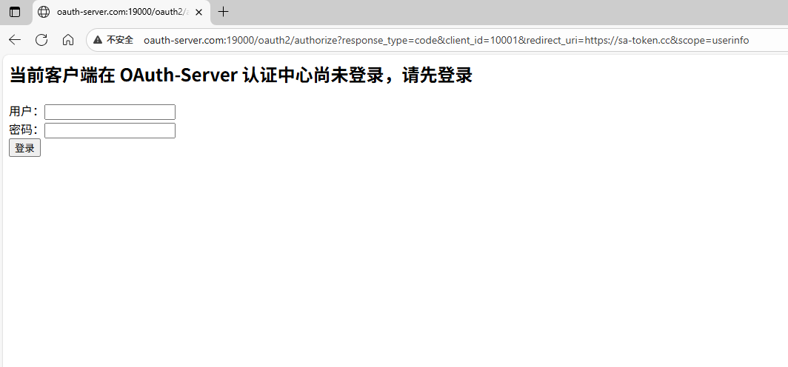
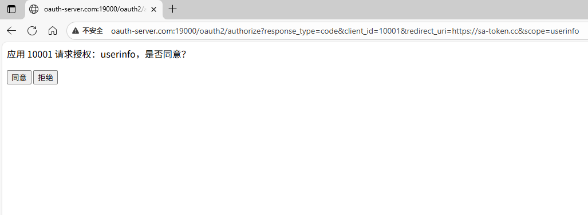
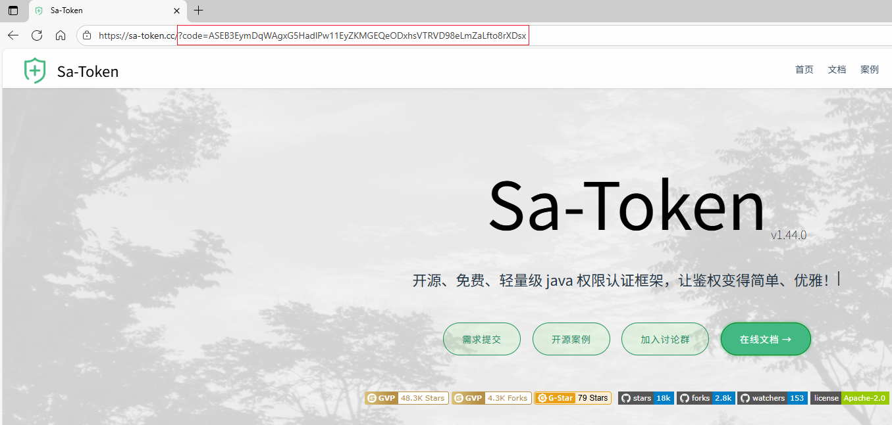
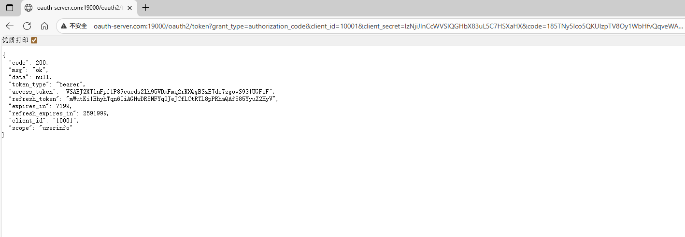

# oauth-protocol-demo


> 基于 [sa-token](https://sa-token.dev33.cn/) 实现oauth2协议

* [sa-token-oauth2-server](https://sa-token.cc/doc.html#/oauth2/oauth2-server)
* https://github.com/netbuffer/oauth-protocol-demo
* https://gitee.com/netbuffer/oauth-protocol-demo

### help
1. 编辑`C:\Windows\System32\drivers\etc\hosts`增加如下配置
```
127.0.0.1 oauth-server.com
127.0.0.1 oauth-client.com
```
2. 访问 [/oauth2/authorize](http://oauth-server.com:19000/oauth2/authorize?response_type=code&client_id=10001&redirect_uri=https://sa-token.cc&scope=userinfo) 进行登录授权  
检测用户在oauth2 server上的登录状态，登录后，再进行oauth2授权流程





3. 访问 [/oauth2/token](http://oauth-server.com:19000/oauth2/token?grant_type=authorization_code&client_id=10001&client_secret=lzNjiJInCcWVSIQGHbX83uL5C7HSXaHX&code={code}) 获取access_token等信息(替换掉其中的code授权码参数)

